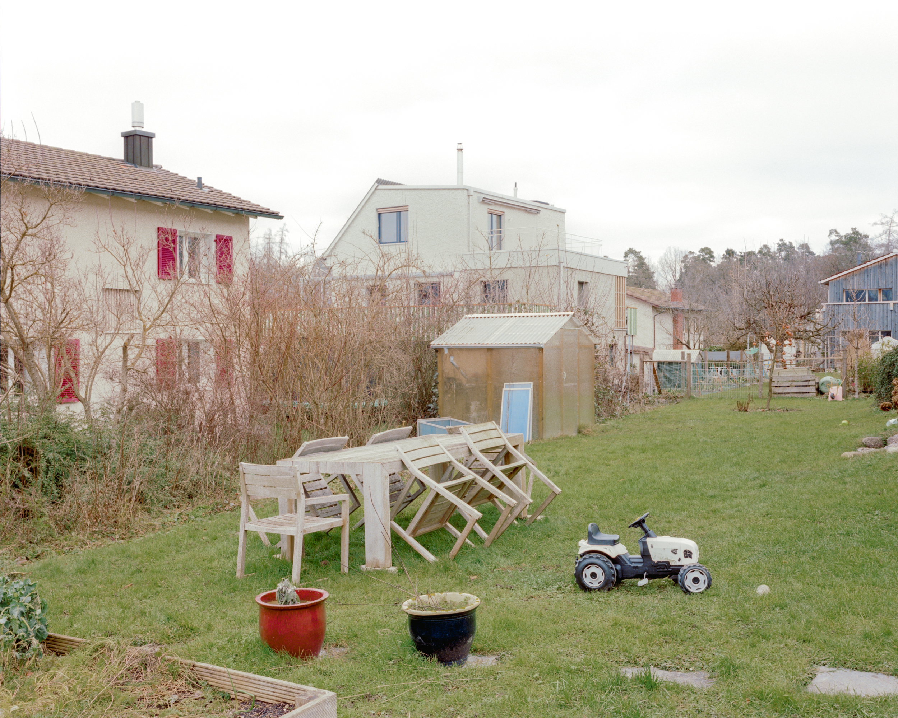

# WARP.md

This file provides guidance to WARP (warp.dev) when working with code in this repository.

## Architecture Overview

This is a static architecture portfolio website for Sander Lückers Architektur GmbH. The site features a two-column layout with dynamic navigation and image galleries showcasing architectural projects.

### Core Architecture
- **Pure Vanilla JavaScript**: No frameworks, single-page application with smooth scrolling
- **Responsive Design**: Desktop and mobile layouts using CSS media queries (breakpoint at 768px)
- **Two-Column Layout**: Fixed left sidebar with dynamic navigation, scrollable right content area
- **Project Structure**: Section-based content with individual project galleries
- **Dynamic Text System**: Image descriptions appear in sidebar based on scroll position

### Key Technical Components
- **Scroll-Based Navigation**: Active section detection at 60% viewport height reference point
- **Dynamic Text Updates**: Image descriptions dynamically update in left column as user scrolls
- **Mobile Menu**: Hamburger menu for mobile view with toggle functionality
- **Debounced Scroll Handler**: 50ms debounce for performance optimization
- **Header Visibility**: Auto-hiding header on mobile when scrolling past header height

## Development Workflow

### No Build Process Required
This is a static site with no build step. Edit files directly and refresh browser to see changes.

### Testing Changes Locally
```bash
# Option 1: Python simple server
python3 -m http.server 8000

# Option 2: PHP built-in server
php -S localhost:8000

# Then open http://localhost:8000
```

### Deploying Changes
Upload files directly to web server. No compilation or bundling needed.

## Adding New Projects

### 1. Add Project Section in HTML
In `index.html`, add a new `<section>` with unique ID:
```html
<section id="NewProject">
    <div class="Bilder" data-description="Project description text">
        
    </div>
    <!-- Add more image divs as needed -->
</section>
```

### 2. Add Project Text in Left Column
In the `.left-column` area, add project description div:
```html
<div id="NewProject-text" class="project-description" style="display: none;">
    <p>Location<br>Project Type<br>Client Type<br>Year<br>Status</p>
</div>
```

### 3. Add Navigation Links
Add navigation link in both places:
- Inside `#navigation-above` div
- Inside mobile menu `.mobile-menu`

```html
<a href="#NewProject">Project Name</a>
```

### 4. Add Images to img/ Directory
- Use consistent naming: `PRJ-01.jpg`, `PRJ-02.jpg`, etc.
- Images are typically large JPEGs (1.5-5MB each)
- Naming conventions observed:
  - TOE = Tödistrasse
  - KRK = Krokusstrasse  
  - BMS = Birmensdorferstrasse
  - BIJ = Bijenven

## File Structure and Responsibilities

### index.html
- Complete site structure and content
- All projects defined as `<section>` elements
- Project descriptions in left column as separate divs
- Navigation links in fixed header and dynamic areas

### script.js
- `updateActiveSection()`: Detects which section is at 60% viewport height
- `updateNavigationDisplay()`: Shows appropriate navigation above/below active project
- `updateDynamicText()`: Updates image description based on scroll position
- `handleHeaderScroll()`: Mobile header visibility logic
- Mobile menu toggle handler

### styles.css
- **Desktop styles** (`@media (min-width: 769px)`): Two-column flex layout
- **Mobile styles** (`@media (max-width: 768px)`): Single column, stacked layout
- `.fixed-header`: Contact info and site introduction
- `.text-section`: Contains project descriptions and dynamic navigation
- `.right-column`: Scrollable image gallery
- `.Bilder`: Individual image container with spacing

### Configuration
- `SCROLL_DEBOUNCE_MS = 50`: Scroll event throttling
- `VIEWPORT_REFERENCE_PERCENT = 0.6`: Active section detection point (60% down viewport)

## Image Management

### Adding Images to Existing Project
1. Add image file to `img/` directory with project prefix (e.g., `TOE-11.jpg`)
2. Add corresponding `<div class="Bilder">` in the project's `<section>`
3. Include `data-description` attribute for the image caption
4. Use descriptive `alt` text for accessibility

### Image Naming Convention
- Use project prefix (3 letters) + sequential number
- Examples: `TOE-01.jpg`, `KRK-15.jpg`, `BMS-09.jpg`
- Keep numbering sequential within each project

### Image Descriptions
- Set via `data-description` attribute on `.Bilder` div
- Supports HTML (use `<br><br>` for paragraph breaks)
- Include photo credits: `Photo © Photographer Name`
- Descriptions appear in left column when image is at 60% viewport height

## Apache Configuration

### Cache Control
Two `.htaccess` variants are provided:

**`.htaccessnocache`** - Development mode:
- Disables all caching for images, CSS, and JS
- Use when actively developing/testing changes
- Ensures browser always fetches fresh content

**`.htacceswithcache`** - Production mode:
- Images cached 30 days
- CSS/JS cached 7 days  
- Better performance for visitors
- Rename to `.htaccess` to activate

To switch modes, rename the desired file to `.htaccess`.

## Content Guidelines

### Project Text Format
Standard format in left column:
```
Location
Project Type
Client Type (usually "Direktauftrag")
Year
Status (laufend/abgeschlossen)
```

### Navigation Structure
Projects appear in this order (from top):
1. Home (landing page)
2. Tödistrasse (Pfäffikon)
3. Krokusstrasse (Dietikon)
4. Birmensdorferstrasse (Zürich)
5. Bijenven (Uitdam, NL)
6. Info (about/contact section)

### Info Section Special Handling
The Info section has special scroll behavior - scrolls to 20% viewport offset rather than top of section (see `script.js` lines 31-38).

## Responsive Behavior

### Desktop (>768px)
- Two-column flex layout (25% left, 75% right)
- Fixed left column with scrollable right
- Standard navigation links
- Header always visible

### Mobile (≤768px)
- Single column, stacked layout
- Hamburger menu (☰) for navigation
- Auto-hiding header on scroll
- Smaller font sizes (10px base vs 13.33px desktop)
- Mobile menu toggles with `#menu-toggle` button

## Key Patterns

### Scroll Reference Point System
The site uses a 60% viewport height reference point for all scroll-based interactions:
- Active section detection
- Dynamic text updates  
- Navigation state changes

This creates a natural "reading position" where content becomes active before reaching the top.

### Navigation Split Pattern
Navigation splits around the active project:
- Links to earlier projects appear above
- Active project link is highlighted (italic)
- Links to later projects appear below

This provides context of position within the portfolio.

### Data Attributes
- `data-description`: Image captions (on `.Bilder` divs)
- `data-nav-name`: Optional custom navigation text (on `<section>` elements)
- `data-target-section`: Link target section ID (added dynamically by JS)

## Common Modifications

### Change Homepage Image
Edit line 90 in `index.html`:
```html

```

### Reorder Projects
1. Move entire `<section>` blocks in HTML
2. Reorder corresponding navigation links
3. Reorder project description divs in left column
4. JavaScript automatically handles new order

### Adjust Scroll Timing
In `script.js`, modify:
- `SCROLL_DEBOUNCE_MS`: Lower for more responsive, higher for better performance
- `VIEWPORT_REFERENCE_PERCENT`: Adjust active section trigger point (0.6 = 60%)

### Change Image Spacing
In `styles.css`, modify `.Bilder` margin values:
```css
.Bilder {
    margin-top: 50px;
    margin-bottom: 15%; /* Space between images */
}
```
